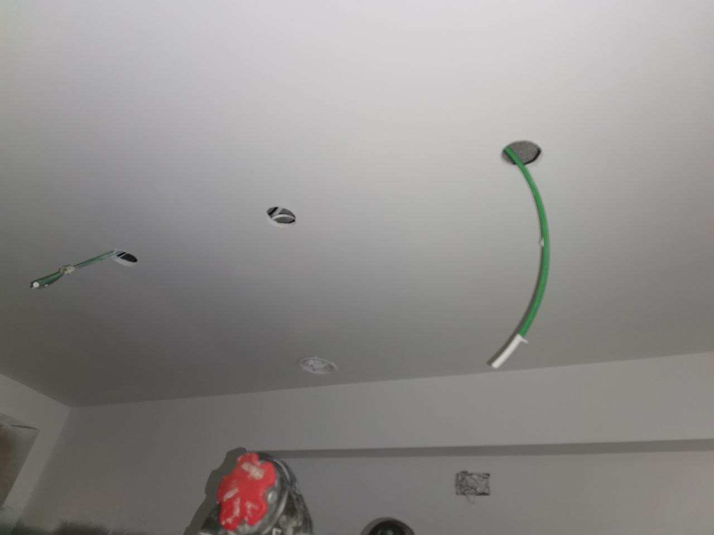
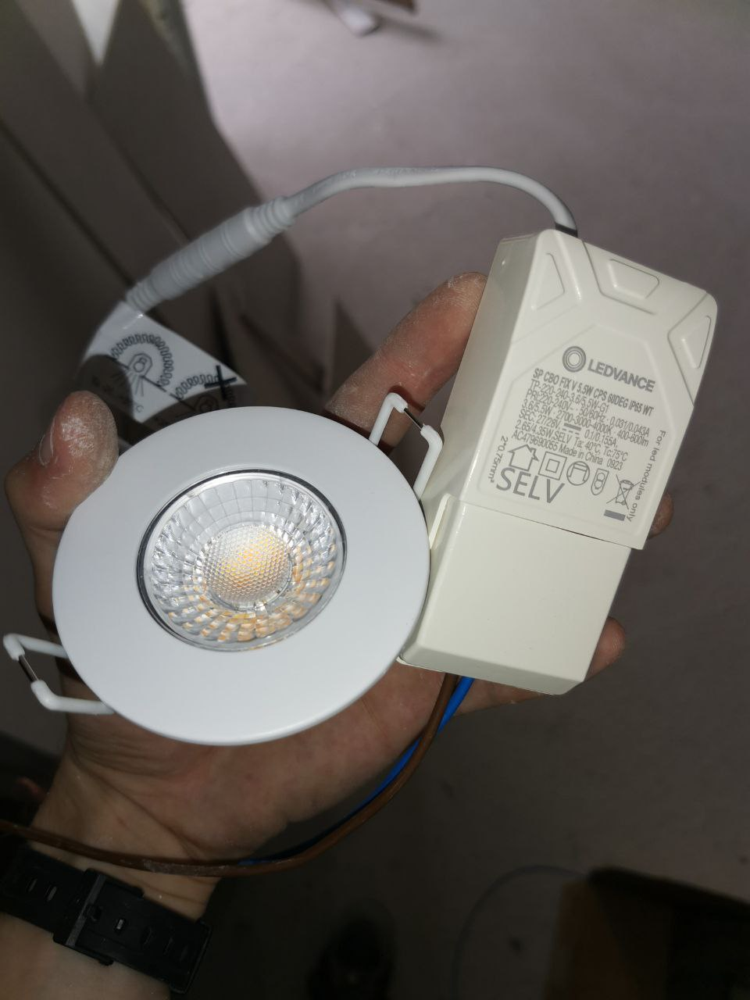
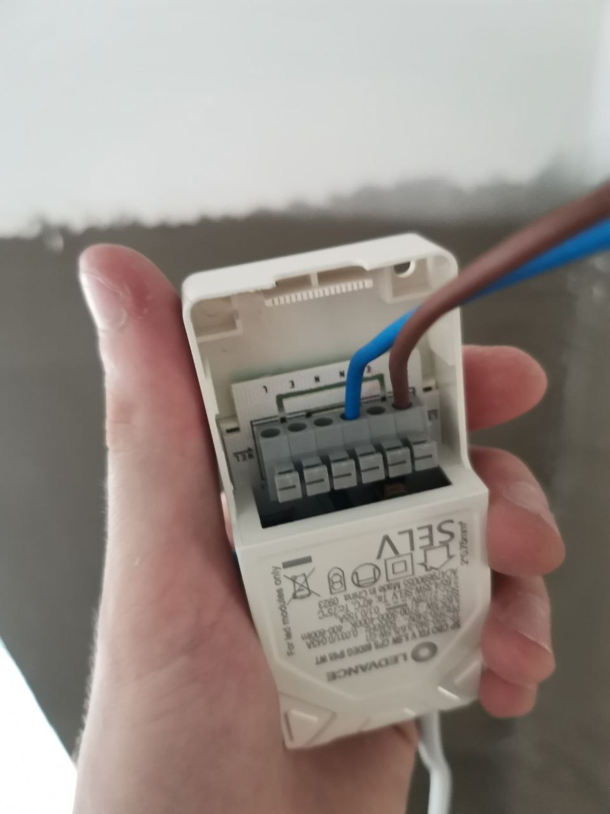
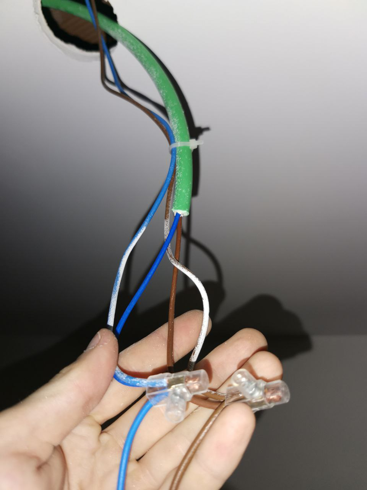
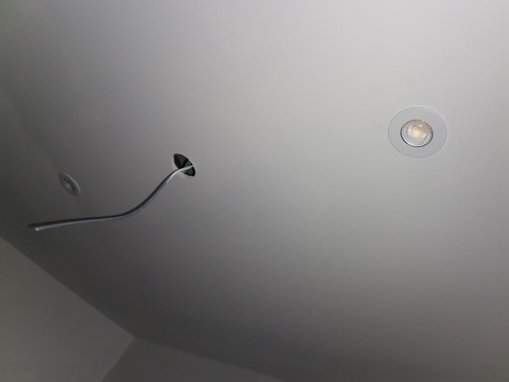
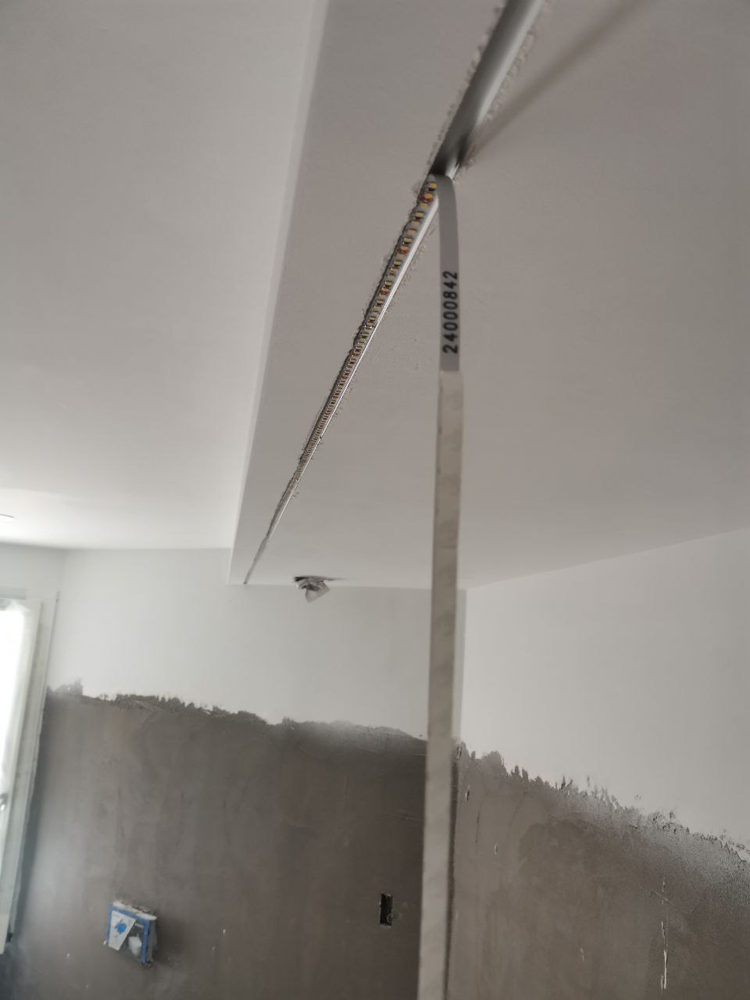
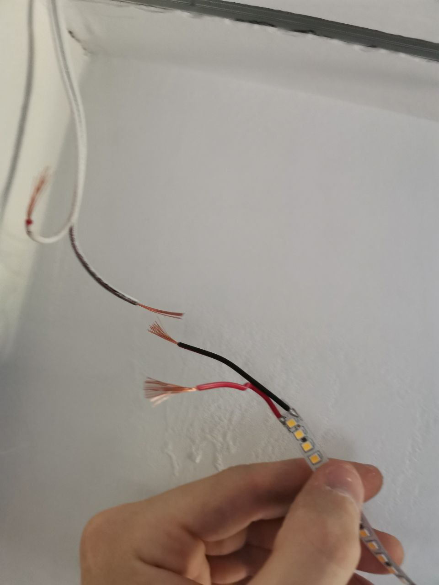
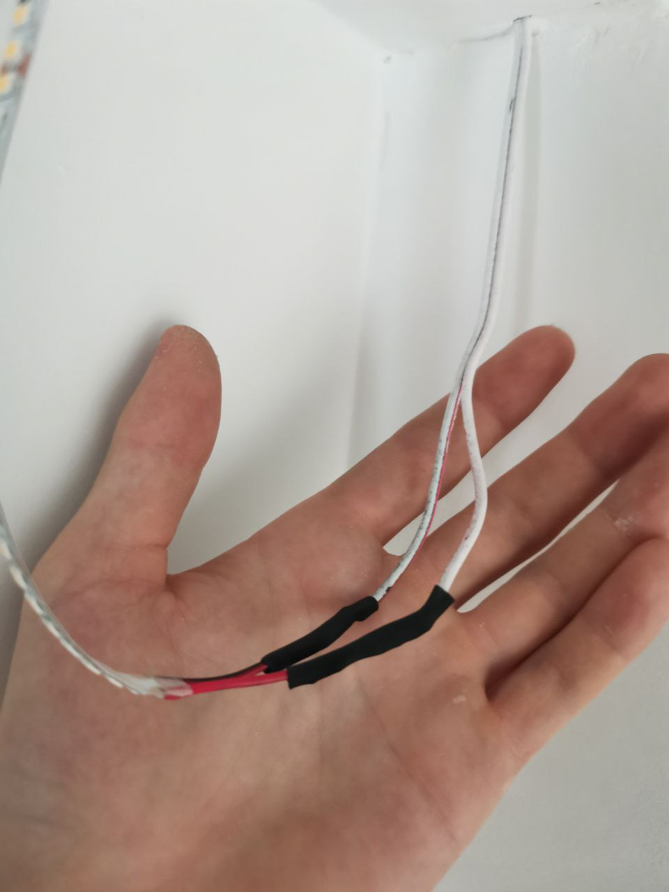

# Installation-and-testing-of-light-in-the-bathroom-LED-strip-and-LED-lamps-

Tools used: 
Electrician's scissors,
electrical terminals for 1.5 mm wires,
electrical tape,
measuring tape,
4 mm flat screwdriver,
heat shrink and a lighter.

Start of work

Here we see first of all a photo of poor quality for which I apologize at work there is no time to take a good photo,
and now to the point:
a cable in green insulation which is required by the rules 1x2 blue and brown,
separately with it there are the same 2 wires but just 1.5 mm which are responsible for switching on the other side there is just a green cable in insulation
(We don't need a cable in the middle)

The used LED lamp is from Ledvance with a power regulator of 3.6 W - 5.5 W and a color temperature switch (2700-3000-4000K)

Connection is made with 2 wires (phase and neutral) 
in auto clamps 
(by pressing, inserting the cable and releasing, 
sometimes you have to mechanically push the mechanism back so that the cable is fixed ALWAYS CHECK THE RELIABILITY OF THE FIXED CABLES)

connection of the lamp, commutation and another lamp is carried out by terminals

The wires are inserted inside, the springs on the lamp are compressed and the lamps are installed.

Next step LED Strip

The length of the platform is measured with a tape measure,
the required length of the LED strip is cut off and glued to the platform using 3M tape

The wires are stripped (the wire from the LED and the ready-made ones from the wall) and connected to each other

The joint is protected by heat shrink

This circuit is powered by a LED DRIVER which is hidden in the junction box.

The final step is the performance test,
All necessary wires of the circuit are twisted and insulated with electrical tape, 
the phase and neutral are insulated from each other to prevent a short circuit.

Using a network filter connected to an industrial outlet,
2 bare wires are inserted into the filter (dangerous, take precautions, do not touch the cables together,
hold them by the insulated parts, first connect the neutral, then the phase, disconnect in the reverse order

